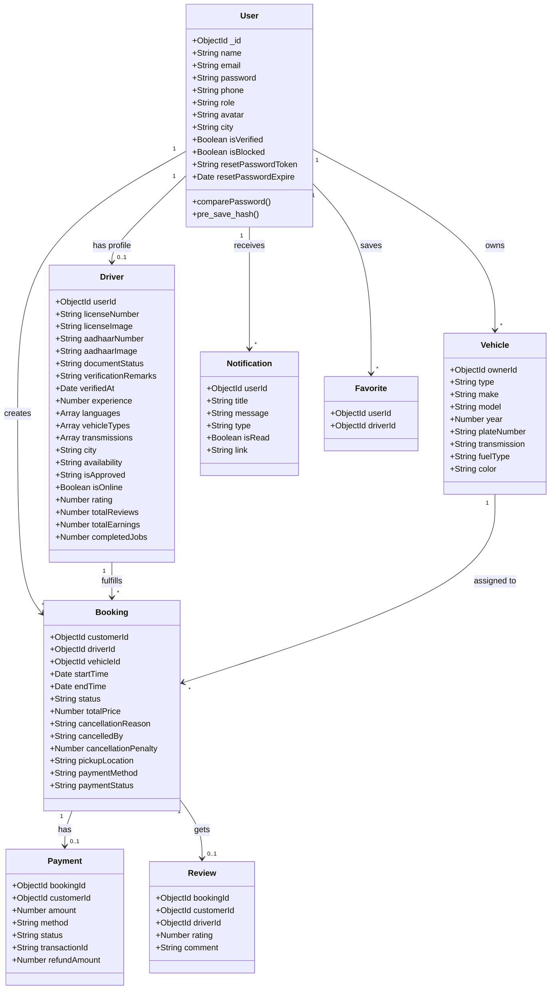
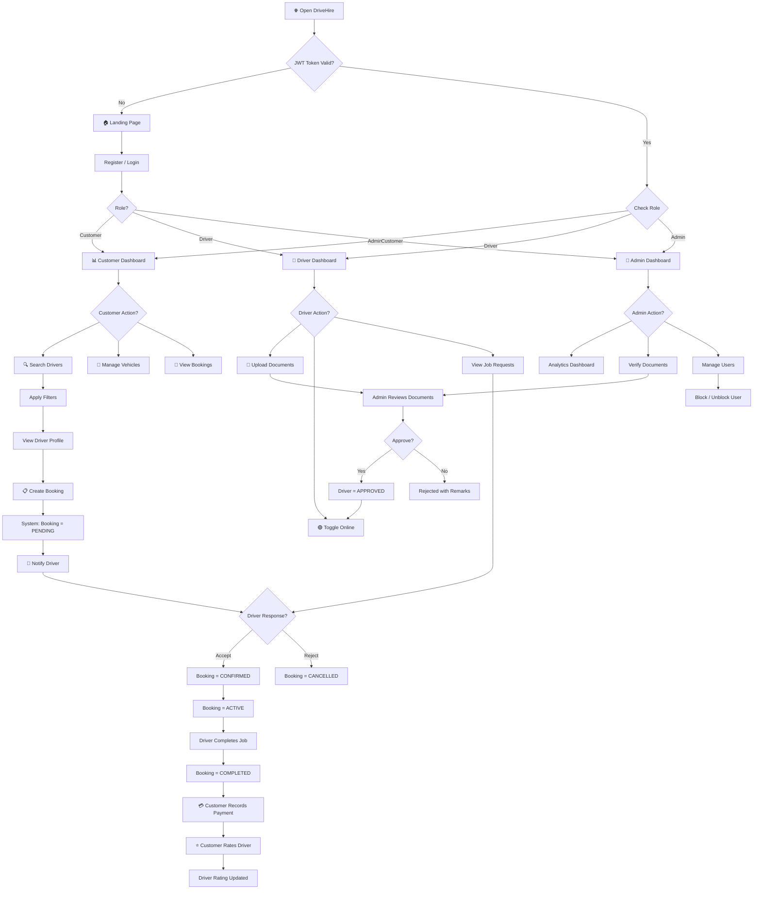

# A PROJECT REPORT ON

# **DriveHire – A Full-Stack Driver Hiring & Fleet Management Platform**

---

**Submitted by**

## **Abhay [Your Full Name]**

in partial fulfilment for the award of the degree of

### BACHELOR OF SCIENCE

in

### COMPUTER SCIENCE

under the guidance of

### [Your Guide's Name]

Department of Computer Science

### [YOUR COLLEGE NAME]

**(2025-2026)**

**(Sem VI)**

---

---

# DECLARATION

I, **MR. ABHAY [YOUR FULL NAME]**, hereby declare that the project entitled **"DriveHire: A Full-Stack Driver Hiring & Fleet Management Platform"** submitted in the partial fulfilment for the award of Bachelor of Science in Computer Science during the academic year 2025–2026 is my original work and the project has not formed the basis for the award of any degree, associateship, fellowship or any other similar titles.

**Signature of the Student:**

**Place:**

**Date:**

---

---

# PREFACE

The gig economy and on-demand services sector is expanding at an unprecedented rate across India. The demand for professional, reliable drivers—whether for daily commutes, outstation trips, or dedicated fleet management—has surged dramatically. Yet, the process of finding, verifying, and hiring qualified drivers remains fragmented, unreliable, and heavily dependent on word-of-mouth referrals. Customers face difficulties verifying driver credentials, while skilled drivers struggle to find consistent employment opportunities.

**DriveHire** was conceptualized to directly address this gap. This project presents a modern, comprehensive web-based solution that seamlessly bridges the connection between vehicle owners seeking professional drivers and verified drivers looking for employment. By digitizing the entire hiring lifecycle—from driver discovery and document verification to booking management and payment processing—DriveHire eliminates the friction inherent in the traditional driver-hiring process.

The platform provides a holistic and highly engaging user experience across three distinct user roles: **Customers**, **Drivers**, and **Administrators**. Customers can search for drivers by city, vehicle type, and availability; view detailed profiles with verified credentials; and manage their bookings through an intuitive dashboard. Drivers can create professional profiles, upload verification documents, manage job requests, and track their earnings in real-time. Administrators oversee the entire ecosystem through a powerful analytics dashboard, managing user accounts, verifying driver documents, and monitoring platform health.

Built on a robust **MERN stack** (MongoDB, Express.js, React, Node.js) and deployed as a **Progressive Web Application (PWA)**, DriveHire leverages cloud services including Cloudinary for media management and Render for production hosting. The platform features secure JWT-based authentication, role-based access control, real-time notifications, and a polished dark-themed UI with fluid animations.

Through this project, I have gained valuable hands-on experience in:

- **Full-Stack MERN Development** using MongoDB, Express.js, React, and Node.js
- **RESTful API Design** and JWT-based Authentication with Role-Based Access Control
- **Document Verification Workflows** for real-world identity management
- **Cloud Storage Integration** with Cloudinary for persistent media management
- **Progressive Web App (PWA)** implementation with Service Workers and Web App Manifest
- **Responsive UI/UX Design** with custom CSS, glassmorphism, and micro-animations
- **Software Development Lifecycle Management** following iterative development

---

---

# ACKNOWLEDGEMENT

I would like to extend my sincerest appreciation to all those who have contributed to the development and success of the DriveHire platform.

First and foremost, I am deeply grateful to **[Your Guide's Name]**, for providing invaluable guidance, constant support, and insightful feedback throughout this project. Their expertise and encouragement helped refine the vision for this platform and ensured the successful completion of this work.

Special thanks to the open-source communities behind React, Node.js, Express.js, MongoDB, Cloudinary, and Vite whose extensive documentation and community forums were a constant source of knowledge and problem-solving assistance.

I must also express my gratitude to my fellow classmates and friends, who provided their assistance and shared their knowledge during various stages of the project. Their collaborative spirit and valuable inputs were instrumental in improving the system's functionality and overall user experience.

Finally, I am grateful to my family for their unwavering support and encouragement throughout the duration of this project.

---

---

# Index

| Sr. No | Title | Page No. | Signature |
|--------|-------|----------|-----------|
| 1 | Preliminary Design | 6 | |
| 1.1 | Introduction | 7 | |
| 1.2 | Objective | 9 | |
| 1.3 | Stakeholders [Technical, User and Client] | 11 | |
| 1.4 | System in Use | 13 | |
| 2 | System Analysis | 16 | |
| 2.1 | Gantt Chart | 17 | |
| 2.2 | Class Diagram | 19 | |
| 3 | System Design | 22 | |
| 3.1 | Use Case Diagram | 23 | |
| 3.2 | System Flow Chart | 25 | |
| 4 | System Description | 28 | |
| 4.1 | Database Description Table (Attribute, Datatype and Constraint) | 29 | |
| 4.2 | Module Description | 35 | |
| 4.3 | System Runtime Output | 41 | |
| 4.4 | Coding | 43 | |
| 5 | Testing | 52 | |
| 6 | Conclusion | 60 | |
| 7 | Undertaking | 62 | |
| 8 | Bibliography | 63 | |

---

---

# 1. Preliminary Design

---

## 1.1 Introduction

**DriveHire** is a comprehensive full-stack Driver Hiring & Fleet Management Platform developed on the **MERN stack** (MongoDB, Express.js, React, Node.js). The application digitizes the entire driver-hiring lifecycle, providing a trustworthy, transparent, and feature-rich environment for vehicle owners, professional drivers, and system administrators.

### Application Concept:

India's rapidly evolving gig economy has created an unparalleled demand for professional driver services. Vehicle owners—ranging from daily commuters to fleet operators—regularly require skilled, verified drivers for personal use, corporate needs, and outstation travel. However, the traditional process of hiring drivers is riddled with inefficiencies: lack of proper credential verification, inconsistent availability tracking, no standardized pricing, and virtually zero accountability mechanisms. Customers rely on unorganized local networks and word-of-mouth, often with no way to verify a driver's license, identity documents, or professional track record.

DriveHire was developed directly in response to this challenge. It implements a **three-role system**—Customers, Drivers, and Administrators—each with dedicated dashboards, workflows, and capabilities.

### Core Application Features:

**Driver Discovery & Search:** Customers can filter and find verified drivers based on city, vehicle type (car/bike), transmission preference (manual/automatic), availability, experience level, and ratings. Results display driver cards with ratings, verification badges, and key statistics.

**Multi-Stage Document Verification:** Drivers must submit their Driving License and Aadhaar Card for admin review before being approved to accept jobs. Admins can approve, reject with remarks, or request re-submission — creating a trusted, verified driver pool.

**Complete Booking Lifecycle:** The platform manages the full booking workflow — from initial request through driver acceptance, active engagement, completion, cancellation (with penalty tracking), and post-trip review. Every state transition is tracked and timestamped.

**Star-Based Rating & Review System:** Customers rate completed bookings with 1–5 stars and write reviews. Driver ratings are aggregated and prominently displayed, building a transparent reputation layer that helps customers make informed hiring decisions.

**Vehicle Fleet Management:** Customers manage their personal vehicle fleet (cars and bikes) with full CRUD operations. Vehicles are assigned to booking requests, including make, model, year, fuel type, and transmission details.

**Admin Analytics Dashboard:** Administrators access a rich dashboard with platform KPIs — total users, active drivers, pending verifications, total bookings, revenue metrics, and booking status distribution charts.

**Progressive Web Application (PWA):** Deployed with Service Worker caching, Web App Manifest for installability, and custom install prompts — providing a native-app-like experience on mobile and desktop.

### Technical Implementation:

- **Frontend:** React 19 + Vite 7 with Custom CSS (dark theme, glassmorphism), React Router v7
- **Backend:** Node.js v24 + Express.js 5, Mongoose ODM, JWT authentication
- **Database:** MongoDB Atlas (cloud-hosted)
- **Media Storage:** Cloudinary CDN for avatars and documents
- **Deployment:** Render (frontend + backend), MongoDB Atlas

### Target Platform:

**Primary Platform:** Web Browser (Chrome, Firefox, Safari, Edge) & PWA (installable)

**Minimum Requirements:**
- Modern web browser with JavaScript enabled
- Internet connection
- Screen resolution: 320px and above (fully responsive)

---

## 1.2 Objective

### Primary Objectives:

**1. Application Development Goal:**
- Build an intelligent search and filtering system for verified driver discovery
- Design a multi-stage document verification workflow for platform trust
- Implement the complete booking lifecycle with automated state management
- Integrate a star-based rating and review system for community reputation
- Deploy as a Progressive Web Application with offline capabilities

**2. Technical Learning Objectives:**
- Gain proficiency in full-stack MERN development (MongoDB, Express, React, Node.js)
- Understand and implement RESTful API design with role-based access control
- Master JWT-based authentication with bcrypt password hashing
- Learn NoSQL database design for complex relational data
- Implement cloud storage integration with Cloudinary CDN
- Configure PWA with Service Workers, Web App Manifest, and install prompts

**3. Software Engineering Objectives:**
- Apply Software Development Lifecycle (SDLC) principles across 6 development phases
- Implement modular and scalable architecture with clean separation of concerns
- Practice iterative development with continuous testing and refinement
- Document the project comprehensively for academic and professional purposes

### Specific Functional Objectives:

**FO1: User Authentication & Security**
- Implement secure registration with email, phone, and password validation
- JWT token-based login with role-specific dashboard redirection
- Role-based access control: Customer / Driver / Admin
- Password hashing with bcrypt (12 salt rounds)
- Password reset with crypto-generated tokens and expiry timestamps

**FO2: Driver Profile & Verification**
- Driver profile creation with license number, experience, city, languages, and vehicle types
- Document upload pipeline for Driving License and Aadhaar Card via Cloudinary
- Admin document review workflow with approve/reject and verification remarks
- Online/offline toggle for real-time availability management

**FO3: Customer Portal**
- Advanced driver search with city, vehicle type, transmission, and availability filters
- Vehicle fleet management with full CRUD operations
- Favorite/bookmark drivers for quick access
- Support ticket submission for assistance

**FO4: Booking Lifecycle Engine**
- Booking creation with vehicle, dates, pickup location, and payment method selection
- State machine: pending → confirmed → active → completed / cancelled
- Cancellation with reason tracking and penalty calculation
- Automated notifications at every state transition

**FO5: Payment & Invoicing**
- Payment recording against completed bookings (UPI/Card/Netbanking/Wallet/Cash)
- Invoice management with transaction history and payment breakdowns
- Automated transaction ID generation (TXN + timestamp + random)

**FO6: Rating & Review System**
- Post-booking star rating (1–5 stars) with text review
- Driver aggregate rating calculation updated on each new review
- Review display on driver public profiles

**FO7: Admin Dashboard & Control**
- Analytics dashboard with KPIs and Recharts visualizations
- User management: view all, block/unblock accounts
- Platform-wide booking oversight with cancellation capability
- Pricing rule configuration and maintenance mode toggle

**FO8: Progressive Web Application**
- Service Worker with Workbox for offline caching
- Web App Manifest for installability on mobile and desktop
- Custom cross-platform PWA install prompt

---

## 1.3 Stakeholders [Technical, User and Client]

### Technical Stakeholders:

- **Student Developer (Myself):** As the sole developer and architect, responsible for the entire project lifecycle — from UI/UX design and frontend development in React to backend API development with Node.js/Express, database schema design in MongoDB, cloud integration with Cloudinary, and production deployment on Render
- **Project Guide/Professor:** Provides academic oversight, technical mentorship, and regular evaluation. Ensures the project adheres to BSc CS curriculum standards and fulfills requirements for the final degree assessment
- **DevOps/Deployment:** Managing Render hosting configuration, environment variables, MongoDB Atlas cluster management, and Cloudinary storage setup
- **Security Specialists:** Ensuring JWT implementation, bcrypt hashing, role-based middleware, and route-level authorization are correctly implemented

### User Stakeholders:

- **Vehicle Owners (Customers):** The primary consumer audience. Their main interest is utilizing DriveHire as a reliable, trustworthy platform to find verified drivers quickly. They judge the platform based on how effectively it simplifies the search process and the quality of driver verification
- **Professional Drivers:** The supply-side audience. Skilled drivers seeking consistent employment opportunities through the platform. Their interest lies in creating a professional profile, getting verified quickly, receiving job requests, and tracking their earnings transparently
- **Fleet Operators & Businesses:** Organizations managing multiple vehicles that require a steady pool of verified drivers. Their interest is in the platform's ability to handle fleet-scale bookings and maintain service quality standards
- **Guest Visitors:** Unauthenticated individuals exploring the platform's public-facing landing pages to understand its value proposition before registering

### Client Stakeholders:

- **The College/University:** As the academic institution hosting this project, the college acts as the primary client. The project serves as a capstone requirement for the Bachelor of Science degree. The institution's interest is in fostering high-quality, innovative software engineering practices
- **Marketing/Platform Administrators:** Professionals focused on user acquisition, driver verification quality, platform trust metrics, and overall ecosystem health
- **Financial Analysts:** Stakeholders monitoring booking volumes, revenue metrics, payment methods, and financial performance across the platform

---

## 1.4 System in Use

### A. Hardware Requirements:

**Development Hardware:**
- **Computer System:**
  - Processor: Intel Core i5/AMD Ryzen 5 or higher
  - RAM: 8GB minimum, 16GB recommended
  - Storage: 256GB SSD with at least 20GB free space
  - Display: 1920×1080 resolution monitor

**End-User Hardware Requirements:**
- Any device with a modern web browser (PC, laptop, tablet, smartphone)
- Camera (optional — for profile picture upload)
- Minimum 2GB RAM
- Active internet connection (for PWA: basic offline support after first load)

### B. Software Requirements:

**Development Software:**

1. **Runtime Environment:**
   - Node.js: Version 24.x LTS or higher
   - npm: Version 10.x or higher

2. **Database:**
   - MongoDB Atlas (cloud-hosted M0 Free Tier)
   - MongoDB Compass: GUI for database management

3. **Integrated Development Environment:**
   - Visual Studio Code (Primary IDE)
   - Extensions: ESLint, Prettier, MongoDB for VS Code

4. **Version Control:**
   - Git: For source code management
   - GitHub: Remote repository hosting with auto-deploy to Render

5. **Media Storage:**
   - Cloudinary: Cloud-based image and document storage with CDN

6. **API Testing:**
   - Postman / Thunder Client (for API endpoint testing)

### C. Programming Languages & Technologies:

**Frontend Technologies:**
- **React 19:** Component-based UI library with hooks architecture
- **Vite 7:** Build tool with fast HMR and optimized production builds
- **React Router v7:** Client-side routing with protected route guards
- **Custom CSS:** CSS variables, Flexbox, Grid, glassmorphism, dark theme
- **React Icons (Feather):** Icon library
- **React Toastify:** Toast notification system
- **NProgress:** Page transition progress indicator
- **React Easy Crop:** Client-side avatar cropping with zoom control

**Backend Technologies:**
- **Node.js v24:** JavaScript runtime for server-side logic
- **Express.js 5:** Web framework for REST API routing
- **Mongoose:** MongoDB ODM for schema modeling and validation

**Authentication & Security:**
- **JWT (jsonwebtoken):** Token-based stateless authentication
- **bcryptjs:** Password hashing (12 salt rounds)
- **Multer + Cloudinary Storage:** File upload handling with cloud persistence
- **crypto:** Built-in module for password reset token generation

**PWA Technologies:**
- **Service Worker (Workbox):** Offline caching strategies
- **Web App Manifest:** Installability on mobile and desktop

### D. System Architecture:

```
Client (Browser / PWA)
    ↓ HTTP/HTTPS
Express.js Server (Node.js)
    ↓ Mongoose ODM
MongoDB Atlas (Cloud Database)
    ↓
Cloudinary CDN (Media Storage)
```

**Architecture Pattern:**
```
Frontend (React SPA) → Protected Routes → Role-Based Dashboards
    ↓ Fetch API (JWT Bearer Token)
Express Routes (Controller) → protect() + authorize() Middleware
    ↓
Controllers (Business Logic) → Mongoose Models
    ↓
MongoDB Atlas (Persistent Data)
    ↓
Cloudinary (Avatars + Documents)
```

### E. Deployment Environment:

- **Frontend:** Render Static Site with auto-build from GitHub
- **Backend:** Render Web Service with auto-deploy from GitHub main branch
- **Database:** MongoDB Atlas M0 Free Tier with database-level indexing
- **Media CDN:** Cloudinary with separate folders for avatars (`drivehire/avatars`) and documents (`drivehire/documents`)
- **Version Control & CI:** Git + GitHub with automatic Render deploy triggers

---

---

# 2. SYSTEM ANALYSIS

## 2.1 Gantt Chart

**Project Timeline: 4 Months (November 2025 – February 2026)**

**Phase Breakdown:**

```
PHASE 1: Concept & System Architecture (Week 1)
├── Research existing driver-hiring platforms and ride-sharing apps
├── Define three-role system (Customer, Driver, Admin)
├── Select tech stack (React + Node.js + MongoDB + Cloudinary)
├── Finalize dark-themed UI aesthetic with glassmorphism
└── Map database schema relationships

PHASE 2: Database & UI Prototyping (Weeks 2–3)
├── Design MongoDB schemas (Users, Drivers, Vehicles, Bookings, Payments, Reviews, Notifications)
├── Build basic UI component library and DashboardLayout shell
├── Prototype authentication pages (Login, Register)
└── Initialize Vite + React project with custom CSS design system

PHASE 3: Core Development — Auth & Driver Module (Weeks 4–7)
├── Implement JWT authentication with bcrypt (register/login/protect middleware)
├── Build driver profile creation and management
├── Implement Cloudinary document upload pipeline
├── Build admin document verification workflow (approve/reject with remarks)
└── Admin document review modal with image inspection

PHASE 4: Booking, Payment & Review System (Weeks 8–11)
├── Implement complete booking lifecycle state machine
├── Build customer vehicle fleet management (CRUD)
├── Build driver search with advanced filters
├── Implement payment tracking and invoicing
├── Build star-based rating and review system
└── Add cancellation handling with penalty tracking

PHASE 5: Admin Dashboard & Advanced Features (Weeks 12–14)
├── Build admin analytics dashboard with Recharts KPI charts
├── Implement real-time notification system
├── Add favorites/bookmarks functionality
├── Build support ticket system
├── Add booking calendar view
└── Implement maintenance mode toggle and pricing rules

PHASE 6: PWA, Cloudinary & Deployment (Weeks 15–16)
├── Integrate Cloudinary for all media (avatars + documents)
├── Implement Service Worker with Workbox caching strategies
├── Configure Web App Manifest and custom install prompts
├── Avatar upload with React Easy Crop client-side cropping
├── Performance optimization and cross-device responsive testing
├── Write project documentation (this Black Book)
└── Configure production deployment on Render
```

**Gantt Chart Diagram:**

_(Insert your Gantt Chart diagram here)_

---

## 2.2 Class Diagram

**System Architecture – Data Model Design (Mongoose Schemas):**

In the context of DriveHire's Node.js and MongoDB architecture, the Class Diagram represents the underlying Mongoose data models and their relationships rather than traditional OOP classes.



**Entity Relationships:**

- **User → Driver:** One User (with role 'driver') has exactly One Driver profile (1..1)
- **User → Vehicle:** One User (Customer) can have Many Vehicles (1..*)
- **User → Booking:** One User (Customer) creates Many Bookings (1..*)
- **Driver → Booking:** One Driver fulfills Many Bookings (1..*)
- **Vehicle → Booking:** One Vehicle is assigned to Many Bookings (1..*)
- **Booking → Payment:** One Booking has One Payment (1..1)
- **Booking → Review:** One Booking has One Review (1..1)
- **User → Notification:** One User receives Many Notifications (1..*)

**Class Diagram:**

_(Insert your Class Diagram here)_

---

---

# 3. SYSTEM DESIGN

## 3.1 Use Case Diagram

```mermaid
graph TB
    subgraph "DriveHire Platform"
        UC1["Register / Login"]
        UC2["Search Drivers"]
        UC3["View Driver Profile"]
        UC4["Add to Favorites"]
        UC5["Manage Vehicles"]
        UC6["Create Booking Request"]
        UC7["Track Booking Status"]
        UC8["Cancel Booking"]
        UC9["Make Payment"]
        UC10["Rate & Review Driver"]
        UC11["View Booking Calendar"]
        UC12["View Invoices"]
        UC13["Update Profile & Avatar"]
        UC14["View Notifications"]
        UC15["Submit Support Ticket"]
        UC16["Setup Driver Profile"]
        UC17["Upload Documents"]
        UC18["Toggle Online/Offline"]
        UC19["Accept / Reject Jobs"]
        UC20["Mark Job Complete"]
        UC21["Track Earnings"]
        UC22["Admin Analytics Dashboard"]
        UC23["Verify Driver Documents"]
        UC24["Manage Users"]
        UC25["Manage Bookings"]
        UC26["Configure Pricing & Maintenance"]
    end

    Guest(("👤 Guest"))
    Customer(("🧑 Customer"))
    Driver(("🚗 Driver"))
    Admin(("👑 Admin"))

    Guest --> UC1
    Customer --> UC1
    Customer --> UC2
    Customer --> UC3
    Customer --> UC4
    Customer --> UC5
    Customer --> UC6
    Customer --> UC7
    Customer --> UC8
    Customer --> UC9
    Customer --> UC10
    Customer --> UC11
    Customer --> UC12
    Customer --> UC13
    Customer --> UC14
    Customer --> UC15

    Driver --> UC1
    Driver --> UC16
    Driver --> UC17
    Driver --> UC18
    Driver --> UC19
    Driver --> UC20
    Driver --> UC21
    Driver --> UC13
    Driver --> UC14

    Admin --> UC1
    Admin --> UC22
    Admin --> UC23
    Admin --> UC24
    Admin --> UC25
    Admin --> UC26
```



**Actor Descriptions:**

**Guest Visitor:** An unauthenticated individual exploring the platform's public-facing landing pages to understand its value proposition. Can view About, FAQ pages, and proceed to registration.

**Customer (Authenticated):** A vehicle owner who has registered and logged in to find, hire, and manage professional drivers. Unlocks the complete hiring workflow.

**Driver (Authenticated):** A professional driver who has registered, created a profile, and is seeking employment opportunities through the platform. Manages their professional presence and job workflow.

**Administrator:** A privileged user with backend access to monitor platform health, verify driver documents, manage users, and configure system settings.

**Use Case Diagram:**

_(Insert your Use Case Diagram here)_

---

## 3.2 System Flow Chart

### System Flow Chart Description:

The System Flow Chart maps the logical sequence of operations and decisions a user experiences while navigating the DriveHire platform.

**Application Entry:**
When the user opens the application, the React `AuthContext` checks for an existing JWT token in localStorage. If valid, the user is routed to their role-specific dashboard. If not, they see the Landing Page.

**Authentication Path:**
Users register with name, email, phone, password, and role selection. Upon successful authentication, a JWT token is stored in localStorage and the user is redirected to their dashboard.

**Customer Hiring Flow (Core):**
1. Customer navigates to Search Drivers page
2. Applies filters (city, vehicle type, transmission, availability)
3. Views driver cards with ratings and verification badges
4. Opens Driver Profile for full details, reviews, and contact info
5. Clicks "Book Driver" → selects vehicle from fleet, sets dates, pickup location
6. System creates Booking with 'pending' status → notifies driver
7. Driver accepts → Booking moves to 'confirmed' → customer notified
8. Booking becomes active → driver completes job → moves to 'completed'
9. Customer records payment → system creates Payment record
10. Customer submits star rating and review → Driver's aggregate rating updates

**Driver Job Flow:**
1. Register and fill profile details (license, experience, city, languages, vehicle types)
2. Upload Driving License and Aadhaar Card via Cloudinary
3. Documents enter 'pending_review' state → Admin notified
4. Admin approves → Driver receives approval notification
5. Driver toggles Online → appears in customer search results
6. Receives job request notification → views full booking details
7. Accepts or Rejects → if accepted, booking moves to 'confirmed'
8. Completes job → earnings credited → customer prompted to rate

**Admin Verification Flow:**
1. Views pending driver documents in Admin Dashboard
2. Opens document review modal → inspects License and Aadhaar images
3. Approves (sets documentStatus = 'verified') or Rejects with mandatory remarks
4. Driver receives instant notification of verification result



**Use Case Diagram:**

_(Insert your System Flow Chart here)_

---

---
